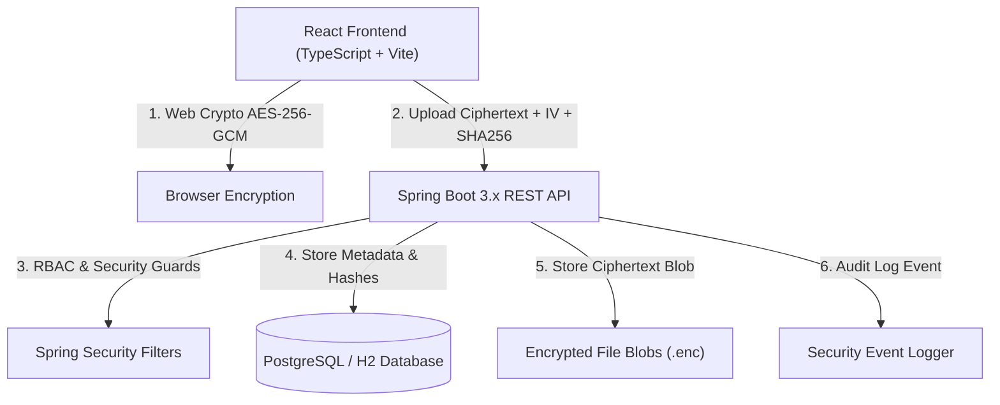

# SecureX — Secure File Exchange Portal with Ephemeral Link Control

[](https://www.oracle.com/java/)
[](https://spring.io/projects/spring-boot)
[](https://react.dev/)
[](https://www.typescriptlang.org/)
[](LICENSE)

SecureX is a production-style, zero-trust **Secure File Exchange Portal** demonstrating end-to-end client-side encryption (AES-256-GCM), integrity checksum verification (SHA-256), and cryptographic ephemeral link control.

> **Zero-Knowledge Core Requirement**: The server NEVER receives, sees, or stores plaintext files or raw encryption keys.

---

## High-Level Architecture Diagram



---

## Key Features

1. **Client-Side End-to-End Encryption**:
   - Files are encrypted in the browser using the **Web Crypto API** (AES-256-GCM).
   - A unique 96-bit random IV is generated for every encryption operation.
   - Decryption keys are stored in the URL fragment (`#key=...`) and are never sent to the backend server.
2. **Cryptographic Integrity Verification**:
   - SHA-256 checksums are calculated in the browser prior to upload and verified after download.
3. **Ephemeral Share Links**:
   - Cryptographically secure random tokens (256-bit CSPRNG).
   - High-entropy tokens are hashed (SHA-256) before storing in the database.
   - Configurable expiration (e.g. 1h, 24h, 7d), download limits (e.g. 1, 3, 5), optional password protection, and optional recipient email restrictions.
   - Atomic counter updates prevent race condition download limit bypasses.
4. **RBAC & Security Administration**:
   - Role-Based Access Control (`ROLE_USER` and `ROLE_ADMIN`).
   - Admin dashboard featuring real-time security audit log stream and system metrics.
5. **Security Hardening**:
   - SQL Injection protection via JPA parameterized queries.
   - Path traversal prevention using UUID-based storage filenames.
   - Rate limiting on Auth and Public Share endpoints.
   - Content-Security-Policy (CSP), Strict-Transport-Security (HSTS), and security headers.

---

## Technology Stack

- **Backend**: Java 17/21, Spring Boot 3.2.3, Spring Security, Spring Data JPA, Hibernate, Bean Validation, JJWT, Flyway, OpenAPI / Swagger UI.
- **Frontend**: React 18, TypeScript, Vite, Tailwind CSS, Lucide React icons, Axios, Web Crypto API.
- **Database**: PostgreSQL 15 / H2 Database.
- **DevOps**: Docker, Docker Compose, Nginx.

---

## Directory Structure

```text
securex/
├── backend/
│   ├── src/main/java/com/securex/
│   │   ├── config/ (SecurityConfig, WebConfig, SwaggerConfig, RateLimiterFilter)
│   │   ├── controller/ (AuthController, FileController, ShareController, PublicShareController, AdminController)
│   │   ├── dto/ (Auth, File, Share, Audit DTOs)
│   │   ├── entity/ (User, FileEntity, ShareLink, DownloadEvent, AuditLog)
│   │   ├── repository/ (UserRepository, FileRepository, ShareLinkRepository, AuditLogRepository)
│   │   ├── security/ (JwtTokenProvider, CustomUserDetailsService, SecurityUtils)
│   │   ├── service/ (AuthService, FileStorageService, ShareService, AuditLogService)
│   │   └── exception/ (GlobalExceptionHandler)
│   ├── pom.xml
│   ├── Dockerfile
│   └── README.md
├── frontend/
│   ├── src/
│   │   ├── components/ (Navbar, Sidebar, FileUploadModal, CreateShareModal, Alert)
│   │   ├── pages/ (LoginPage, RegisterPage, DashboardPage, MyFilesPage, SharesPage, PublicSharePage, AdminDashboardPage)
│   │   ├── services/ (api.ts, crypto.ts)
│   │   ├── context/ (AuthContext.tsx)
│   │   ├── App.tsx
│   │   └── main.tsx
│   ├── package.json
│   ├── Dockerfile
│   └── README.md
├── database/
│   └── migrations/
│       └── V1__initial_schema.sql
├── docs/
│   ├── architecture.md
│   ├── security.md
│   ├── api.md
│   └── threat-model.md
├── docker-compose.yml
├── .env.example
├── SECURITY.md
└── README.md
```

---

## Running with Docker Compose

Ensure Docker and Docker Compose are installed, then execute:

```bash
docker compose up --build
```

Access services:
- **Frontend App**: `http://localhost:5173`
- **Backend REST API**: `http://localhost:8080`
- **Swagger API Documentation**: `http://localhost:8080/swagger-ui.html`

---

## Share Link Base URL Configuration

The application dynamically resolves share links to prevent invalid `localhost` links when shared with external or local network receivers.

### Configuration Modes:

1. **Local Development Mode**:
   - Default fallback automatically detects the server's network LAN IP (e.g. `http://192.168.1.x:5173`) or request origin.
2. **LAN Network Testing**:
   - Set environment variable: `PUBLIC_BASE_URL=http://<YOUR_SERVER_LAN_IP>:5173` (or port 8080).
   - Generated share links will use the server's accessible IP address.
3. **Production / Cloud Deployment (Render, AWS, GCP, etc.)**:
   - Set environment variable: `PUBLIC_BASE_URL=https://your-domain.com`.
   - Generated share links will use the public production domain (e.g. `https://your-domain.com/share/<unique-token>#key=...`).

---

## Development Seed Data

Default test accounts created on initial launch:

| Role | Email | Password |
|---|---|---|
| **User** | `alice@securex.local` | `AlicePassword123!` |
| **Admin** | `admin@securex.local` | `AdminPassword123!` |

---

## Future Improvements

1. WebAuthn / Passkeys integration.
2. AWS S3 / MinIO object storage backing.
3. Envelope encryption with recipient public-key cryptography (RSA/ECDH).
4. Virus scanning & DLP integration.
5. Key rotation and hardware security module (HSM) support.
