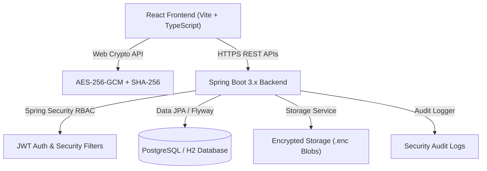

# SecureX System Architecture

## High-Level Diagram

## Core Components
1. **Frontend**: React 18 SPA built with Vite, TypeScript, and Tailwind CSS.
2. **Backend**: Java 17/21 Spring Boot REST application with Spring Security, Data JPA, and Flyway.
3. **Database**: PostgreSQL (production) or H2 (local zero-config demo).
4. **File Storage**: Server disk abstraction layer storing raw encrypted ciphertext blobs.
